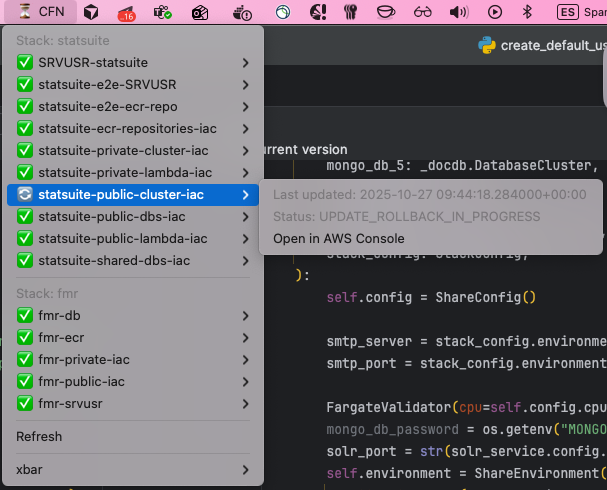
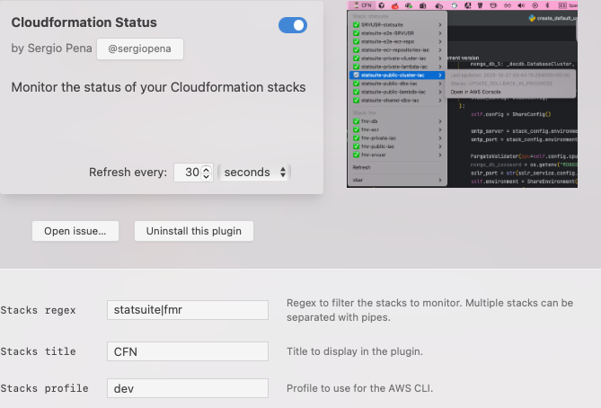

# CloudFormation Status - xbar Plugin

Monitor the status of your AWS CloudFormation stacks directly from your macOS menu bar.



## Features

- Visual indicators with emojis for different stack states
- Filter stacks using regex patterns
- Direct links to open stacks in AWS Console
- Automatic refresh every 30 seconds

## Installation

1. Install xbar from [xbarapp.com](https://xbarapp.com/)
2. Install Python dependencies:
   ```bash
   pip install boto3 pydantic
   ```
3. Copy `cloudformation-status.30s.py` to your xbar plugins directory
4. Make the script executable:
   ```bash
   chmod +x cloudformation-status.30s.py
   ```
5. Update the shebang line (line 1) to point to your Python installation

## Configuration

Configure the plugin using xbar's variables menu:



### Available Variables

- **VAR_STACKS_REGEX**: Regex pattern to filter stacks (default: `"Pipeline-Name"`)
  - Multiple patterns can be separated with pipes: `"Pattern1|Pattern2|Pattern3"`
  
- **VAR_STACKS_TITLE**: Title displayed in the menu bar (default: `"CLOUDFORMATION STATUS"`)

- **VAR_STACKS_PROFILE**: AWS CLI profile to use (default: `"dev"`)

## Stack Status Indicators

The plugin uses emoji indicators to show stack status:

- ✅ Complete (CREATE_COMPLETE, UPDATE_COMPLETE, IMPORT_COMPLETE)
- ⏳ In Progress (CREATE_IN_PROGRESS, UPDATE_IN_PROGRESS, DELETE_IN_PROGRESS)
- 🔄 Rollback in Progress (ROLLBACK_IN_PROGRESS, UPDATE_ROLLBACK_IN_PROGRESS, IMPORT_ROLLBACK_IN_PROGRESS)
- ⚠️ Warning (ROLLBACK_COMPLETE, UPDATE_ROLLBACK_COMPLETE, IMPORT_ROLLBACK_COMPLETE)
- ❌ Failed (CREATE_FAILED, UPDATE_FAILED, DELETE_FAILED, etc.)

## Requirements

- macOS
- xbar app
- Python 3.x
- boto3
- pydantic
- AWS credentials configured (via AWS CLI profiles)

## License

DO WHAT THE FUCK YOU WANT TO PUBLIC LICENSE
Version 2, December 2004

Everyone is permitted to copy and distribute verbatim or modified
copies of this license document, and changing it is allowed as long
as the name is changed.

DO WHAT THE FUCK YOU WANT TO PUBLIC LICENSE
TERMS AND CONDITIONS FOR COPYING, DISTRIBUTION AND MODIFICATION

0. You just DO WHAT THE FUCK YOU WANT TO.

## Author

**Sergio Pena**

- GitHub: [@sergiopena](https://github.com/sergiopena)

## Contributing

Contributions, issues, and feature requests are welcome! Feel free to open a pull request or issue.

---

[](http://www.wtfpl.net/)
